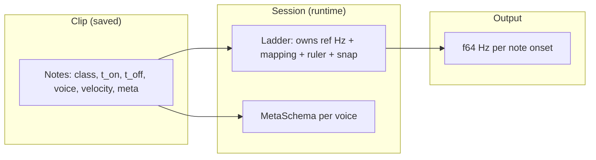
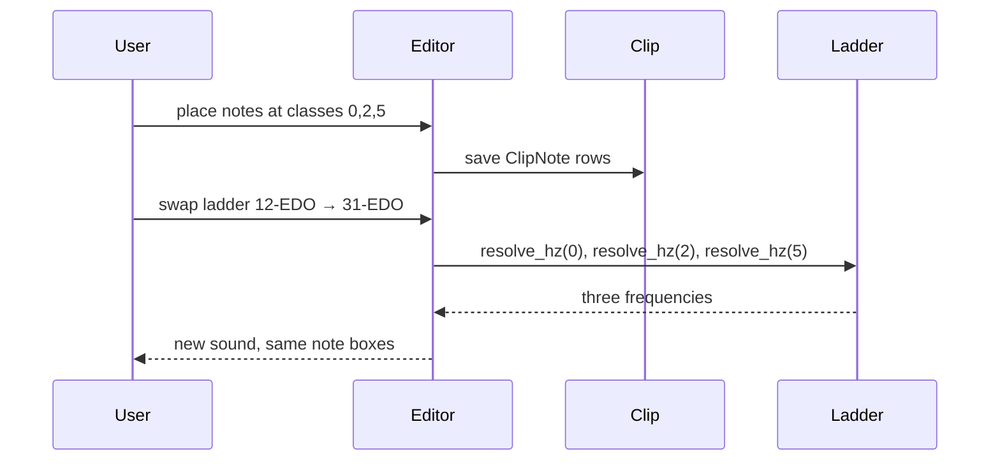

# Clip editor model — first principles (iteration 3)

**Status:** proposal · not implemented  
**Intent:** describe note editing as **placing events on a discrete grid** (time × **class index**). All *meaning* of “what frequency is that row?” lives in one pluggable object, **`Ladder`** (name TBD), which **owns** reference pitch and every other tuning choice. No `reference_hz` parameter on `resolve`.

---

## 1. First principles

### 1.1 What you are actually editing

You are not editing “music theory objects” in the file format. You are editing **marks on a 2D lattice**:

| Axis | Meaning in the data | Meaning in the ear |
|------|---------------------|-------------------|
| **X (time)** | When something starts and ends, in **beats** (exact rationals). | Rhythm, placement in the bar. |
| **Y (class)** | **Which row** of the ladder the mark sits on — a **signed integer** index. | Whatever the active **ladder** says that row sounds like. |

Each **note** is one closed interval in time on one row: **turn sound on at `t_on`, off at `t_off`**, plus **how loud**, **which synth lane (`voice`)**, and **extra slots (`meta`)**.

```text
  class +2  ───────────────────────────────────
  class +1  ───────[ note A ]──────────────────
  class  0  ───────────────────[ note B ]──────
  class -1  ───────────────────────────────────
            │         │         │         │
            0        t1        t2        t3   → time (beats)
```

That is the whole geometric idea: **the editor is a grid**; **a note is a rectangle** (or a bar) in **(time × class)** space.

### 1.2 Why not call the vertical coordinate “pitch”?

In everyday language “pitch” suggests **frequency** or **note name**. The stored value is **neither** — it is an **index into a ladder** the host provides. Calling it `pitch` invites readers to sneak in 12-TET, MIDI numbers, or “octave” fields.

**Suggested names** (pick one vocabulary and use it consistently in code + UI):

| Name | Pros | Cons |
|------|------|------|
| **`class` / `ClassIndex`** | Matches “row = equivalence class of sounding identity under this ladder.” | Overloads OOP “class”; in music theory “pitch class” means something narrower. |
| **`step`** | “Rungs on a ladder.” | Sounds like scale degree only. |
| **`rank`** | Ordered, neutral. | Uncommon in audio UI. |
| **`row` / `RowId`** | Matches the grid mental model. | UI-centric; less good for serialization docs. |

**This document uses `class` / `ClassIndex` (i32)** for the vertical coordinate in the clip. The **ladder** explains what each integer **means in Hz** (and how to draw the ruler).

### 1.3 Separation of concerns (one diagram)



- **Clip** does not store tuning, reference frequency, or scale name.
- **Ladder** is the **only** place that turns **`class → Hz`** (and usually **ruler highlights**, **labels**, **snap**).
- **MetaSchema** is the **only** place that defines **native** per-note metadata fields.

---

## 2. Ladder (replaces “pitch system + external reference”)

### 2.1 Responsibility

A **ladder** is a **self-contained tuning + presentation policy**:

- It **creates** or **holds** the reference frequency (e.g. A4 = 440 Hz) **inside** the implementation — not as an argument on every call.
- It defines **`resolve(class: ClassIndex) -> Hz`** (or `-> f64`).
- Optionally (same object, same lifetime): **`highlight(class)`**, **`label(class)`**, **`snap(class, direction)`**, **`transpose(class, delta)`** — so one swap changes **sound + UI chrome** together.

**API sketch (illustrative):**

```rust
trait Ladder: Send + Sync {
    /// Frequency for this row. Reference Hz is internal to `self`.
    fn resolve_hz(&self, class: i32) -> f64;

    // --- presentation (optional defaults) ---
    fn ruler_tier(&self, class: i32) -> RulerTier { RulerTier::None }
    fn ruler_label(&self, class: i32) -> Option<String> { None }
    fn snap_class(&self, class: i32, dir: SnapDir) -> i32 { class }
}

enum RulerTier { None, Weak, Strong }
enum SnapDir { Nearest, Up, Down }
```

**Why no `reference_hz` parameter:** the ladder **is** the instrument’s tuning context. If the user changes A4, they **reconfigure or replace** the ladder (same as swapping `.scl` / tuning file). The clip’s integers stay put; **Hz** change.

### 2.2 Examples (conceptual)

| Ladder kind | Internal state | `resolve(0)` might be |
|-------------|------------------|------------------------|
| 12-EDO | `ref_hz`, maybe `ref_class` (which index = ref) | Ref note frequency |
| 31-EDO | same pattern | Different step size |
| Limited scale (7 notes / octave repeated) | table of ratios + period | First degree of current octave band |
| Just chord ladder | small fixed table | Literal ratio from root |

### 2.3 Ruler = function of class, not of “semitones”

Heavy lines on the roll are **not** “octave boundaries” in the data model — they are **`ruler_tier(class)`** outputs. A 12-EDO ladder returns **Strong** every 12 rows; a 7-note-per-period scale returns **Strong** every 7; a Bohlen–Pierce ladder uses its own period.

```text
  class:  ...  -2  -1   0   1   2   3   4   5   6   7   8  ...
  tier:        .   .  ██   .   .   .   .  ██   .   .   .     ← example: period 7
```

---

## 3. Clip and note (canonical, renamed)

### 3.1 `ClipNote`

| Field | Type | Role |
|--------|------|------|
| `id` | `u64` optional | Selection, undo, drag |
| **`class`** | **`i32`** | **Vertical grid row** — opaque until ladder resolves |
| `t_on`, `t_off` | `Rational` | Beats; `t_off > t_on` |
| `voice` | `u32` | Which instrument lane / polyphony |
| `velocity` | align with [`NoteEvent`](crates/trem/src/event.rs) | Loudness |
| `meta` | `NoteMeta` | §4 |

### 3.2 `Clip`

```text
Clip {
    notes: Vec<ClipNote>,
    length_beats: Rational,   // optional; can derive from max t_off
}
```

Playback order: sort by `(t_on, voice, id)` (ties defined in impl).

---

## 4. Metadata (native editing) — unchanged in spirit

- **`NoteMeta`:** `Vec<(u32, f64)>` (+ future typed extras); lossless for unknown ids.
- **`MetaSchema`:** per-**voice** list of `MetaFieldDescriptor` (like graph [`ParamDescriptor`](crates/trem/src/graph.rs)).
- **Inspector** is mandatory: single + multi-select, mixed state, undo, **Extra** for undeclared keys.

See iteration 2 for widget-level detail; iteration 3 only **anchors** meta beside the grid model.

---

## 5. Full usage stories

### Story A — “Same drawing, different tuning”

**Mara** draws a melody on the roll: three notes at classes `0`, `2`, `5` with certain timings. She saves the clip.

1. **Session 1:** Ladder = **12-EDO**, ref inside ladder = 440 Hz, class `0` → C4. She hears a familiar chromatic line.
2. **Session 2:** She loads the **same clip** but swaps the ladder to **31-EDO** (ref still internal to that ladder). Classes `0`, `2`, `5` are **the same integers**; **Hz** jump to the new temperament. Ruler strong lines redraw from **`ruler_tier`** (every 31 steps or whatever that ladder defines).

**Lesson:** the file records **geometry + class indices**; **timbre of intervals** is entirely ladder-dependent.



### Story B — “Limited scale ladder”

**Jordan** uses a ladder backed by a **7-note** JI scale per period. Integers walk **degrees**; period **7** gets **Strong** ruler lines. There is **no** `octave` field on the note — “octave” is just **class ± 7** (or whatever period the ladder uses internally).

- Nudge **↑** in the editor: either `class += 1` (chromatic in index space) or ladder-provided **`transpose(class, +1)`** (diatonic in that ladder).

### Story C — “Per-voice metadata”

**Alex** selects a hi-hat note. Inspector shows **only** fields declared for **voice 3** (filter, decay). They bump decay; undo reverts one step. Multi-select on two kicks applies **decay** to both when values were mixed → show **∅**, edit sets both.

### Story D — “Bridge from today’s grid / `NoteEvent`”

**Existing** [`NoteEvent`](crates/trem/src/event.rs) uses `degree` + `octave`. A **`ScaleLadder`** adapter defines:

`class = octave * period_len + degree` (with Euclidean rules matching [`Scale::resolve`](crates/trem/src/pitch.rs)).

Import: grid cell → `ClipNote` with that `class`. Export: optional lossy quantize. **`params`** ↔ `meta.pairs`.

### Story E — “Collaboration”

**Riley** sends a clip JSON to **Sam**, who uses a **different** default ladder. Same integers; Sam hears a different tuning until they agree on a **ladder preset id** bundled with the project (optional future: `ladder_id` + small params in project file — **not** on each note).

---

## 6. Diagrams — end-to-end

### 6.1 Grid + one note

```text
                    TIME (beats) ───────────────────────────────►

         class +1 │                    ████████████
                 │                    █  note     █
         class  0 │████████████████████           ████████████
                 │        ^ t_on          ^ t_off
         class -1 │
                 │
                 ▼
              CLASS (integer rows — meaning from Ladder)
```

### 6.2 Three layers the UI composes

```text
┌─────────────────────────────────────────────────────────────┐
│  Ruler (from Ladder: tier + label per visible class)          │
├─────────────────────────────────────────────────────────────┤
│  Roll canvas │ notes = rectangles in (time × class)          │
│              │ interaction: select, drag, resize, draw       │
├─────────────────────────────────────────────────────────────┤
│  Inspector   │ time/class/voice/velocity + MetaSchema fields │
└─────────────────────────────────────────────────────────────┘
```

---

## 7. Mapping table (old terms → iteration 3)

| Before | Now |
|--------|-----|
| `pitch` (on note) | **`class` / `ClassIndex`** |
| `PitchSystem` + external `reference_hz` | **`Ladder`** with **internal** reference |
| `resolve(pitch, ref_hz)` | **`resolve_hz(class)`** |
| `highlight_tier` | **`ruler_tier(class)`** (same idea, clearer name) |

---

## 8. Open points (smaller than before)

- **Transpose:** global `class ± 1` vs ladder `transpose` — expose both in UI (coarse vs diatonic).
- **Velocity representation:** single type aligned with `GraphEvent` / `NoteEvent`.
- **Project file:** optional `ladder` blob or id so reopening reproduces Hz without user picking ladder manually.

---

## 9. Implementation order (updated)

1. ~~**`ClassIndex` alias + `ClipNote` + `Clip` + serde**~~ — shipped as **`trem-rung`** crate (`trem_rung` in Rust), see §11.  
2. **`Ladder` trait** — `resolve_hz` only first; then `ruler_tier` / `label` / `snap`  
3. **`EdoLadder { n: u32, ref_hz: f64, ref_class: i32 }`**, **`ScaleLadder` adapter**  
4. **`clip_to_timed_events(&clip, &dyn Ladder, bpm, …)`** — no ref_hz arg at call site  
5. **MetaSchema + inspector**  
6. **Roll or list view** sharing the same clip  

---

## 10. Non-goals (revised)

- **MIDI export** — later; **import** exists via **`trem-rung`** (§11).  
- MPE, tempo maps, automation lanes, automatic clip→[`Tree`](crates/trem/src/tree.rs) in v1.

---

## 11. Interchange: **Rung** (subcrate + file format)

The clip model is a **first-class format**, not only an in-memory shape for trem:

| Piece | Location |
|--------|----------|
| Crate | **`crates/trem-rung`** (package `trem-rung`, Rust import `trem_rung`) |
| Human doc | **`crates/trem-rung/README.md`** |
| JSON schema id | Top-level `"format": "rung"`, `"schema_version": 1` |

**Goals:** share clips between tools, version the wire format, and write **reusable transforms** (Rust or any language that reads JSON) without pulling in the full DSP stack.

### 11.1 On-disk JSON (summary)

- Suffix convention: **`.rung.json`**.  
- `ClipNote`: `class`, `t_on` / `t_off` as **exact fraction strings** (`"1/4"`), `voice`, `velocity` in **`0..=1`**, `meta.pairs` as `[[id, value], …]`.  
- Optional **`provenance`** (e.g. import source + mapping id).

### 11.2 MIDI → Rung (simple mapping)

Feature **`midi`** on **`trem-rung`**. Default rules (documented in README):

| MIDI | Rung field |
|------|------------|
| Key `0..=127` | `class = key + class_offset` |
| Channel `0..=15` | `voice` |
| Velocity | `velocity = vel / 127` |
| Time | **1 beat = 1 MIDI quarter note** → `t = tick / ppqn` as [`Rational64`](https://docs.rs/num-rational/) (no tempo warp to wall clock in v1) |

**Ladder afterward:** a **12-EDO ladder** with ref inside the ladder makes `class` sound like MIDI pitch; a **different** ladder reinterprets the **same** integers.

### 11.3 Transforms

Anything that consumes/produces `RungFile` JSON is a valid pipeline stage: quantize classes, merge voices, strip meta, round-trip through another notation tool, etc. Keeping **`trem-rung`** dependency-light (`serde`, `num-rational`, optional `midly`) is intentional.

---

*Iteration 3 + Rung interchange — first principles, ladder owns reference, `class` not `pitch`, diagrams + stories.*
